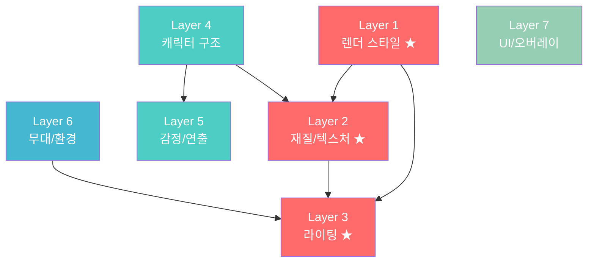

# 🧩 AI 이미지 프롬프트 디자인 프레임워크 v1.0
> 2026년 최신 트렌드 기반 — 3D 캐릭터 콘텐츠 특화

---

## 📌 프레임워크 개요

2026년 AI 이미지 생성 업계에서 통용되는 주요 프레임워크들을 분석하고,
**3D 캐릭터 콘텐츠(SNS/숏폼/카드뉴스)** 용도에 최적화한 구조입니다.

### 참고한 업계 프레임워크
| 프레임워크 | 구조 | 원래 용도 |
|:---:|:---|:---|
| **Five-Descriptor Stack** | Subject → Style → Lighting → Composition → Mood | 범용 이미지 생성 |
| **DPA Method** | Describe → Personalize → Apply | 캐릭터 중심 생성 |
| **CO-STAR** | Context → Objective → Style → Tone → Audience → Response | LLM 범용 (이미지 응용) |
| **Architectural Control** | Visual System 정의 → 제약조건 → 출력 | Recraft.ai 2026 방식 |

---

## 🏗️ 7-Layer 프레임워크

아래 7개 레이어로 프롬프트를 분해합니다.
각 레이어는 **독립적으로 교체 가능**하되, ★ 표시 레이어끼리는 상호 영향이 큽니다.

```
┌─────────────────────────────────────────────────┐
│  Layer 1. 렌더 스타일 (Art Direction) ★         │  ← 전체 DNA 결정
├─────────────────────────────────────────────────┤
│  Layer 2. 재질/텍스처 (Material) ★              │  ← 표면 느낌
├─────────────────────────────────────────────────┤
│  Layer 3. 라이팅 (Lighting) ★                   │  ← 분위기/입체감
├─────────────────────────────────────────────────┤
│  Layer 4. 캐릭터 구조 (Character Structure)     │  ← 형태/비율/의인화
├─────────────────────────────────────────────────┤
│  Layer 5. 감정/연출 (Expression & Motion)       │  ← 표정/포즈/이펙트
├─────────────────────────────────────────────────┤
│  Layer 6. 무대/환경 (Environment)               │  ← 배경/소품/구도
├─────────────────────────────────────────────────┤
│  Layer 7. UI/오버레이 (Text & Overlay)          │  ← 말풍선/텍스트/후처리
└─────────────────────────────────────────────────┘
```

---

## 📋 각 레이어 상세 정의

### Layer 1. 🎨 렌더 스타일 (Art Direction) ★
> **역할**: 이미지 전체의 "세계관"을 한 문장으로 결정
> **2026 트렌드**: "Authenticity > Perfection" — 과도하게 깔끔한 것보다 의도된 질감이 있는 것이 선호됨

| 옵션 | 키워드 예시 | 결과 느낌 |
|:---|:---|:---|
| 클레이/점토 | `clay-like`, `silicon textures`, `characters-style` | 아기자기, 장난감 느낌 |
| 클린 3D | `clean and smooth 3D render`, `stylized` | 광고/제품 소개 느낌 |
| 픽사급 시네마틱 | `Pixar-level quality`, `extremely high-detail` | 영화 한 장면 |
| 포토리얼 | `photorealistic`, `hyperrealistic` | 실사에 가까운 CG |
| 카와이 보타니컬 🆕 | `kawaii botanical illustration`, `soft pastel` | 2026 트렌드 스타일 |
| 네온 누아르 🆕 | `neon noir`, `cyberpunk aesthetic` | 어두운 도시적 느낌 |
| 레트로 Y2K 🆕 | `retro Y2K aesthetic`, `AI surrealism` | 복고+초현실 조합 |

**쉬운 설명**: "이 그림을 한 마디로 뭐라고 부를까?"를 정하는 단계입니다.
1번 프롬프트는 "점토 애니메이션", 3번은 "픽사 영화"를 선택한 것.

---

### Layer 2. 🪵 재질/텍스처 (Material) ★
> **역할**: 캐릭터와 물체 표면의 "만져봤을 때 느낌"
> **2026 트렌드**: 텍스처 묘사가 구체적일수록 AI가 더 정확하게 반영. 핵심 오브젝트는 5~15단어로 묘사 권장

| 수준 | 키워드 예시 | 세 프롬프트 중 |
|:---|:---|:---|
| 최소 묘사 | `smooth`, `soft` | 1번 |
| 특정 재질 | `rounded`, `mold patches on lower body` | 2번 |
| 극세밀 묘사 | `porous texture of lemon rind`, `translucent juicy vesicles`, `individual rice grain texture` | 3번 |

**핵심 규칙 (2026)**:
- 오브젝트당 **표면 질감 + 투명도 + 특이점** 3가지를 묘사하면 최적
- 과도한 묘사(Over-prompting)는 오히려 AI를 혼란시킴 → "핵심 3가지"에 집중

**쉬운 설명**: "이 캐릭터를 손으로 만져보면 어떤 느낌일까?"를 적는 단계입니다.

---

### Layer 3. 💡 라이팅 (Lighting) ★
> **역할**: 분위기, 입체감, 시간대를 결정
> **2026 트렌드**: 단순 `studio lighting`보다 **2개 이상의 광원 조합**이 표준

| 유형 | 키워드 예시 | 효과 |
|:---|:---|:---|
| 기본 스튜디오 | `soft, even studio lighting` | 플랫하고 균일, 귀여움 강조 |
| 따뜻한 스튜디오 | `soft, warm, studio-like lighting` | 아늑하고 감성적 |
| 시네마틱 조합 | `soft diffused light` + `detailed rim lighting for depth` | 영화급 입체감 |
| 골든아워 🆕 | `golden hour lighting`, `golden backlight` | 따뜻하고 드라마틱 |
| 네온/바이오루미네선트 🆕 | `neon lighting`, `bioluminescent glow` | SF/사이버펑크 |
| 볼류메트릭 🆕 | `volumetric god rays` | 신비로운 빛줄기 |

**핵심 규칙 (2026)**:
- `key light(주광) + fill/rim light(보조광)` 2개를 명시하면 퀄리티 급상승
- Layer 1과 **반드시 매칭** 필요 (점토 스타일에 네온 라이팅 → 모순 → AI 혼란)

**쉬운 설명**: "이 장면을 어떤 조명 아래서 촬영할까?"를 정하는 단계입니다.

---

### Layer 4. 🧬 캐릭터 구조 (Character Structure)
> **역할**: 캐릭터의 "뼈대" — 형태, 비율, 의인화 수준
> **2026 트렌드**: 캐릭터 일관성(Character Consistency)이 최대 화두. 캐릭터 시트 운용 권장

| 요소 | 설명 | 예시 |
|:---|:---|:---|
| **기본 형태** | 무엇을 의인화했는가 | 통레몬 vs 반절 레몬 |
| **등신 비율** | 2등신(치비) vs 3등신 vs 리얼 | 1,2번: 2등신 / 3번: 3등신 |
| **의인화 수준** | 팔다리만 vs 옷 착용 vs 표정+제스처 | 1번: 팔다리+나비넥타이 / 3번: 청바지+운동화 |
| **특징 요소** | 차별화 포인트 | 갈색 잎 vs 초록 잎, 곰팡이 위치 |

**핵심 규칙 (2026)**:
- **캐릭터 시트** 개념: 같은 캐릭터를 다각도(정면/측면/뒷면)로 먼저 생성 → 이후 장면에 투입
- 한 번에 5~15단어로 핵심 외형을 정의 (과도한 디테일은 Layer 2 텍스처에서 처리)

**쉬운 설명**: "이 캐릭터의 신체검사표"를 작성하는 단계입니다.

---

### Layer 5. 😭 감정/연출 (Expression & Motion)
> **역할**: 캐릭터에 "생명"을 불어넣는 레이어
> **2026 트렌드**: 정적 이미지에서도 **모션 암시(Motion Cues)**가 핵심 차별화 요소

| 요소 | 설명 | 세 프롬프트 비교 |
|:---|:---|:---|
| **표정** | 눈, 입, 눈썹의 조합 | 순수한 미소 → 활기찬 미소 → 큰 웃음+눈썹 |
| **눈물/땀** | 감정 강도 표현 | 없음 → 눈물 줄줄 → 눈물 한 방울 |
| **포즈** | 몸 전체의 자세 | 으쓱 → 두 손 비비기 → 주먹 쥐기 |
| **모션 이펙트** | 움직임 암시 | 없음 → **떨림선(wavy motion lines)** → 없음 |

**핵심 규칙 (2026)**:
- 2번 프롬프트의 `wavy, vibrating motion lines`처럼 **이펙트 라인**을 명시하면 정적 이미지에 역동성 부여
- 표정은 **눈 + 입 + 눈썹** 3가지를 각각 지정하면 정확도 상승

**쉬운 설명**: "이 캐릭터가 지금 무슨 기분이고, 어떤 동작 중인가?"를 적는 단계입니다.

---

### Layer 6. 🏠 무대/환경 (Environment)
> **역할**: 캐릭터가 서 있는 공간과 소품
> **2026 트렌드**: 의도적 배경 제거(Isolation)도 전략 — 캐릭터에 시선 집중

| 전략 | 키워드 예시 | 세 프롬프트 비교 |
|:---|:---|:---|
| 풀 배경 | `cozy kitchen with fridge, shelves, bottles` | 1번, 2번 |
| 미니멀 배경 | `soft, clean light-blue background` | 3번 |
| 소품 지정 | `wooden cutting board with cloth napkin` | 2번 |
| 배경 완전 제거 | `white background`, `isolated on white` | (해당 없음) |

**핵심 규칙 (2026)**:
- 배경 디테일 ↑ = 캐릭터 주목도 ↓ (트레이드오프)
- SNS 카드뉴스: 풀 배경 권장 (몰입감)
- 유튜브 썸네일: 미니멀 배경 권장 (가독성)

**쉬운 설명**: "이 장면의 무대 세트를 어떻게 꾸밀까?"를 정하는 단계입니다.

---

### Layer 7. 💬 UI/오버레이 (Text & Overlay)
> **역할**: 말풍선, 텍스트, 후처리 가이드
> **2026 트렌드**: 텍스트 렌더링은 AI가 점점 잘하지만, 완벽한 한글은 여전히 후처리 권장

| 전략 | 키워드 예시 | 세 프롬프트 비교 |
|:---|:---|:---|
| 인라인 통합 | 프롬프트 안에 `yellow speech bubble with text '...'` | 1번, 2번 |
| 후처리 분리 | `[Text Post-processing]` 별도 섹션으로 가이드 | 3번 |

**핵심 규칙 (2026)**:
- DALL-E 3/GPT Image: 텍스트 인라인이 비교적 정확
- Midjourney: 텍스트 렌더링 약함 → 반드시 후처리
- **한글**: 어떤 도구든 후처리 권장 (정확도 불안정)

**쉬운 설명**: "글씨와 말풍선을 어떻게 넣을까?"를 정하는 단계입니다.

---

## 🔗 레이어 간 의존성 맵



**의존성 요약**:
- 🔴 **화풍 코어** (L1+L2+L3): 서로 강하게 연결 → **프리셋으로 묶어 관리**
- 🟢 **캐릭터** (L4+L5): 코어와 느슨하게 연결 → 교체 가능하나 텍스처(L2)와 매칭 필요
- 🔵 **무대** (L6): 라이팅(L3)과 매칭만 맞추면 자유 교체
- 🟩 **UI** (L7): 완전 독립 → 언제든 교체 가능

---

## 📐 프리셋 예시: 화풍 코어 3종

### 프리셋 A: 「아기자기 점토」
```
[L1] A cute, characters-style 3D animated scene with soft, smooth clay-like and silicon textures
[L2] smooth, matte surface / soft pastel colors
[L3] Soft, even studio lighting
```
→ **용도**: SNS 카드뉴스, 인스타 릴스 썸네일

### 프리셋 B: 「클린 3D 광고」
```
[L1] A detailed, clean, and smooth 3D render, charming and stylized
[L2] rounded, polished surface / specific detail patches
[L3] Soft, warm, studio-like lighting
```
→ **용도**: 브랜드 광고, 제품 소개, 유튜브 커뮤니티 포스트

### 프리셋 C: 「픽사 시네마틱」
```
[L1] Extremely high-detail, stylized 3D character render of Pixar-level quality with realistic textures
[L2] porous/translucent textures / detailed surface properties
[L3] soft, diffused studio lighting + detailed rim lighting for depth
```
→ **용도**: 유튜브 썸네일, 고퀄리티 특별 콘텐츠

---

## ⚠️ 2026년 핵심 주의사항

### 1. Over-prompting vs Under-prompting
> 2026년 가장 많이 언급되는 실수

| 실수 | 증상 | 해결 |
|:---|:---|:---|
| **Over-prompting** | 너무 많은 디테일 → AI가 혼란, 이상한 결과 | 핵심 오브젝트당 5~15단어 |
| **Under-prompting** | 너무 모호 → 제네릭한 결과 | 최소 Layer 1+4는 구체적으로 |
| **Conflicting** | `minimalist`와 `highly detailed` 동시 사용 | 레이어 간 모순 검사 |

### 2. 캐릭터 일관성 (Character Consistency)
> 2026년 최대 화두 — 같은 캐릭터가 다른 장면에서도 동일하게 보여야 함

- **캐릭터 시트(Reference Sheet)** 먼저 생성 → 이후 Scene에 투입
- Layer 4(구조)를 **고정 텍스트 블록**으로 관리
- Midjourney: `--cref` / Adobe Firefly: Custom Model 활용

### 3. Authenticity > Perfection
> 2026년 트렌드: "너무 완벽하면 오히려 가짜 같다"

- 의도된 불완전함이 매력 (필름 그레인, 자연스러운 피부 텍스처 등)
- 점토 스타일(1번)이 이 트렌드와 가장 잘 맞음

---

## 📝 프롬프트 조립 순서 (실전 워크플로우)

```
Step 1. 용도 결정 → 프리셋(A/B/C) 선택
Step 2. Layer 4: 캐릭터 구조 작성 (형태, 비율, 의인화)
Step 3. Layer 5: 감정/연출 작성 (표정, 포즈, 이펙트)
Step 4. Layer 6: 배경 결정 (풀배경 or 미니멀)
Step 5. Layer 7: 텍스트/말풍선 결정 (인라인 or 후처리)
Step 6. 전체 조립 → 모순 검사 → 생성
Step 7. 결과 확인 → 부족한 레이어만 수정 → 재생성
```

---

## 🗂️ 세 프롬프트를 7-Layer로 분해한 예시

| Layer | 1번 프롬프트 | 2번 프롬프트 | 3번 프롬프트 |
|:---:|:---|:---|:---|
| **L1** 렌더 스타일 | clay-like, silicon, characters-style | clean, smooth 3D render | Pixar-level, realistic textures |
| **L2** 재질 | (미지정) 매끈한 점토 | rounded, mold patches | porous, translucent, juicy vesicles |
| **L3** 라이팅 | soft, even studio | soft, warm, studio-like | diffused + rim lighting |
| **L4** 캐릭터 구조 | 통레몬+갈색잎, 뭉뚝한 쌀 | 통레몬+초록잎, 알갱이쌀 | 반절레몬+청바지, 반투명쌀 |
| **L5** 감정/연출 | 순수한 눈, 슬픈 포즈 | 활기찬 미소, 울음+떨림선 | 큰 웃음+눈썹, 두려움 |
| **L6** 환경 | 파스텔 주방 (풀배경) | 민트냉장고 주방+도마 | 라이트블루 (미니멀) |
| **L7** UI | 인라인 말풍선 | 인라인 말풍선 | 후처리 분리 가이드 |
