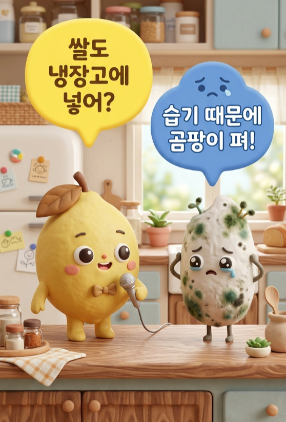

# 📦 스타일 A: 아기자기 클레이

> 점토/실리콘 장난감 느낌의 캐릭터 스타일



---

## 화풍 코어 (L1 + L2 + L3)

| 레이어 | 키워드 | 설명 |
|:---:|:---|:---|
| **L1** 렌더 스타일 | `A cute, characters-style 3D animated scene` | 캐릭터 장난감 애니메이션 |
| **L2** 재질/텍스처 | `Soft, smooth clay-like and silicon textures` | 매끈 점토/실리콘, 디테일 최소 |
| **L3** 라이팅 | `Soft, even studio lighting` | 균일 조명, 그림자 약함 |

---

## 복사용 블록

```
A cute, characters-style 3D animated scene. Soft, smooth clay-like and silicon textures. Soft, even studio lighting.
```

---

## 특징

- ✅ 가장 **간결**한 프롬프트로도 잘 나옴
- ✅ "Authenticity > Perfection" 2026 트렌드에 부합
- ✅ 대량 생산에 유리 (변수가 적어서 일관성↑)
- ⚠️ 고급스러운 느낌은 약함

---

## 적합 용도

`SNS 카드뉴스` `인스타 릴스 썸네일` `키즈 콘텐츠` `일상 팁 시리즈`

---

## 평가

| 항목 | 점수 |
|:---|:---:|
| 결과물 퀄리티 | ⭐⭐⭐ |
| 프롬프트 난이도 | 쉬움 |
| 대량 생산 적합도 | ⭐⭐⭐⭐⭐ |
| 캐릭터 일관성 | ⭐⭐⭐⭐ |
| 시선 끌기(임팩트) | ⭐⭐⭐ |
