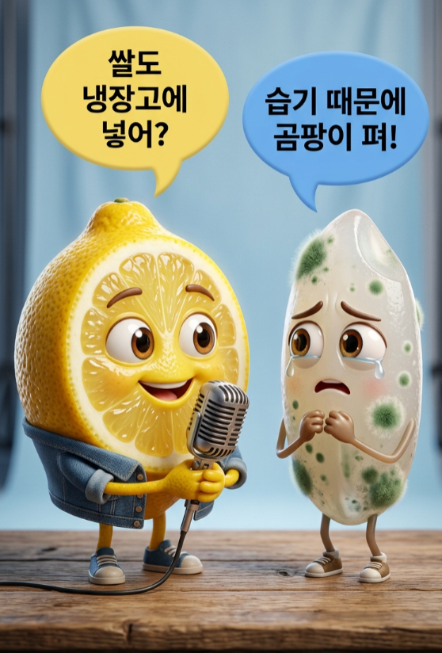

# 📦 스타일 C: 시네마틱 하이디테일

> 픽사급 영화 퀄리티의 극세밀 3D 캐릭터 스타일



---

## 화풍 코어 (L1 + L2 + L3)

| 레이어 | 키워드 | 설명 |
|:---:|:---|:---|
| **L1** 렌더 스타일 | `Extremely high-detail, stylized 3D character render of Pixar-level quality with highly detailed, realistic textures` | 영화급 극세밀 |
| **L2** 재질/텍스처 | 오브젝트마다 `표면질감 + 투명도 + 특이점` 3종 세트 작성 | 레몬 껍질 기공, 과즙 세포 반투명 등 |
| **L3** 라이팅 | `Soft, diffused studio lighting` + `detailed rim lighting for depth` | 주광 + 림라이트 2중 조명 |

---

## 복사용 블록

```
Extremely high-detail, stylized 3D character render of Pixar-level quality with highly detailed, realistic textures. Soft, diffused studio lighting with detailed rim lighting for depth.
```

> ⚠️ L2(텍스처)는 캐릭터마다 별도 작성 필요 — 복사용 블록에 포함 불가
> 
> 텍스처 작성 가이드: 오브젝트당 **표면질감 + 투명도 + 특이점** 3가지를 5~15단어로
> 
> 예시: `Detailed porous texture of the lemon rind, realistic, translucent, juicy vesicles visible in the half-lemon slice`

---

## 특징

- ✅ **WOW 임팩트** 최강 — 결과물이 가장 인상적
- ✅ 림라이팅으로 **입체감/영화적 깊이** 자동 확보
- ⚠️ L2를 매번 상세 작성해야 해서 **프롬프트 작성 비용↑**
- ⚠️ Over-prompting 위험 — 텍스처 묘사 오브젝트당 5~15단어 준수

---

## 적합 용도

`유튜브 썸네일` `특별 콘텐츠` `프리미엄 브랜딩` `포트폴리오`

---

## 평가

| 항목 | 점수 |
|:---|:---:|
| 결과물 퀄리티 | ⭐⭐⭐⭐⭐ |
| 프롬프트 난이도 | 어려움 |
| 대량 생산 적합도 | ⭐⭐ |
| 캐릭터 일관성 | ⭐⭐ |
| 시선 끌기(임팩트) | ⭐⭐⭐⭐⭐ |
